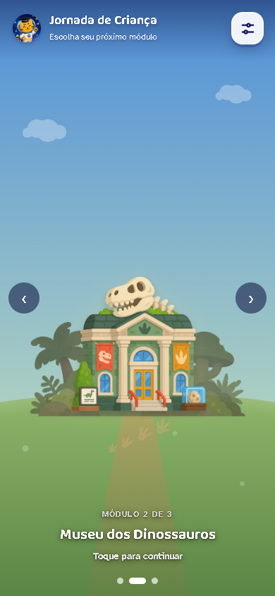
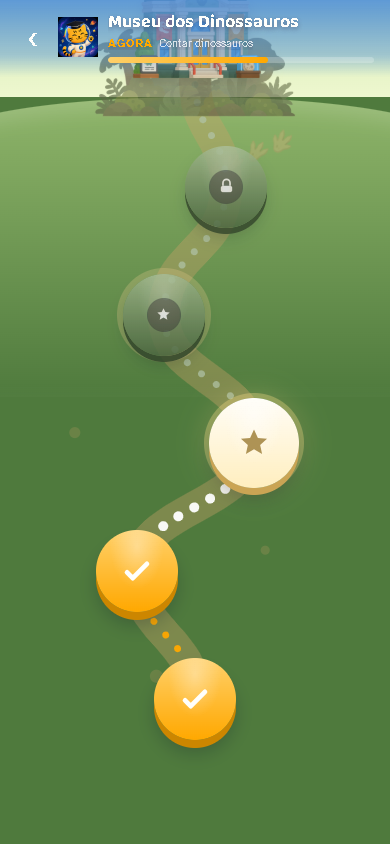

> **Shipaton 2026 — Next Gen submission**
>
> The Android submission is located in [`apps/mobile`](./apps/mobile).
> This branch contains the complete Cognita Hub ecosystem used for the submission.
>
> **Judges:** start at the [Judge quick start](#judge-quick-start) — install the
> prebuilt APK, no environment setup needed.

<p align="center">
  
</p>

<h1 align="center">Cognita Hub</h1>

<p align="center">
  <strong>Mathematics within reach of every mind.</strong>
</p>

<p align="center">
  A human-centered educational ecosystem that supports families, educators and tutors
  in adapting mathematics learning experiences for children with autism.
</p>

<p align="center">
  
  
  
</p>

<p align="center">
  <strong><em>Technology should support the people who know the child — not pretend to replace them.</em></strong>
</p>

## Judge quick start

### Option 1 — Install the Android APK from GitHub Releases

The fastest way to evaluate the Shipaton submission is to install the prebuilt
Android APK available in the repository Releases:

**Cognita Hub — Shipaton Demo**
<https://github.com/Markussdev/CognitaHub/releases/tag/v0.1.0-shipaton>

Open the release, download:

```text
app-debug.apk
```

and install it on an Android device.

Because this APK is distributed directly through GitHub and not through Google
Play, Android may display a warning about installing apps from an unknown
source. Allow installation for the browser or file manager being used, then
continue.

**The APK contains the Android version used for the Shipaton demo and is the
recommended way to reproduce the complete experience, including the native
RevenueCat integration.**

Recommended evaluation flow:

1. Open **Cognita for Schools**
2. Activate the institutional license
3. Open **School overview**
4. Select **Mateus**
5. Explore the **Tutor**, **Child** and **Family** experiences
6. Complete a child activity
7. Return to the Tutor experience and review the pending session
8. Register the session
9. Open the Family experience to see the reviewed feedback

The school, students and tutors shown in the institutional demo are fictional
demonstration data. Mateus is the interactive learner profile used to
demonstrate the connected learning cycle.

### Option 2 — Build the submitted branch from source

Requirements: Node.js 22+, and JDK 21 plus the Android SDK (Android Studio) for
the APK build.

Clone the repository and switch to the Shipaton submission branch:

```bash
git clone https://github.com/Markussdev/CognitaHub.git
cd CognitaHub
git checkout shipaton-2026
cd apps/mobile
npm ci
```

Copy `apps/mobile/.env.example` to `apps/mobile/.env` and configure:

```env
VITE_SUPABASE_URL=
VITE_SUPABASE_ANON_KEY=

VITE_REVENUECAT_TEST_API_KEY=<RevenueCat Test Store SDK key>
VITE_REVENUECAT_ENTITLEMENT_ID=school_access
VITE_REVENUECAT_OFFERING_ID=cognita_school

VITE_SHIPATON_SCHOOL_DEMO=1
VITE_SHIPATON_CHILD_DEMO=1
```

The Cognita for Schools demo surfaces — School overview, Tutor, Child and
Family — use fabricated in-memory data and do not require Supabase. Without
`VITE_SHIPATON_CHILD_DEMO`, the Child card follows the real flow (pairing +
Supabase).

The RevenueCat purchase flow requires:

- a native Android build;
- a valid RevenueCat Test Store SDK key.

Build the app:

```bash
npm run build
npx cap sync android
cd android
```

On Windows:

```bash
.\gradlew.bat assembleDebug
```

On macOS/Linux:

```bash
./gradlew assembleDebug
```

The generated APK is located at:

```text
apps/mobile/android/app/build/outputs/apk/debug/app-debug.apk
```

### Browser preview

The interface can also be previewed locally:

```bash
cd apps/mobile
npm run dev
```

Then open <http://localhost:5173/?school=1>.

The browser preview is intended for UI inspection only: it renders the
Cognita for Schools licence screen. The RevenueCat purchase flow — and the demo
surfaces behind it — run only in the native Android application.

## Repository at a glance

| Path | What it is |
| --- | --- |
| [`apps/mobile/`](./apps/mobile) | **The Android app submitted to Shipaton 2026.** Capacitor + Vanilla JS, an independent package with its own `package.json`, build and Android project. It holds the child experience, device pairing, the RevenueCat institutional-licence flow and the **Cognita for Schools** demo (school overview, tutor, child and family surfaces on local data, no backend). |
| [`pages/`](./pages) · [`js/`](./js) · [`css/`](./css) | **Web companion platform** — the original Cognita Hub web experience used by tutors and families: tutor panel, family panel, admin and the activity library. A Vite multi-page app on Supabase. **Not bundled into the APK.** |
| [`docs/`](./docs) | Product direction ([`PRODUCT.md`](./docs/PRODUCT.md)), system architecture ([`ARCHITECTURE.md`](./docs/ARCHITECTURE.md)), mobile state and plans ([`MOBILE.md`](./docs/MOBILE.md)), database reference ([`DATABASE.md`](./docs/DATABASE.md)) and roadmap ([`ROADMAP.md`](./docs/ROADMAP.md)). |

Both sides belong to the same product and talk to the same Supabase backend in
their connected flows, but they are built and run separately: `npm run build` at
the repository root builds the **web platform only**; the Android app is built
from `apps/mobile` (see [Judge quick start](#judge-quick-start)).

## Learning experience

<p align="center">
  
  &nbsp;&nbsp;
  
</p>

<p align="center">
  <sub>
    The Android experience presents learning journeys as explorable worlds,
    while keeping the interface simple and child-focused.
  </sub>
</p>

The current Android prototype includes child-device pairing, learning journeys,
interactive mathematics activities, profile personalization and configurable
experience settings. The activity layer is modular, allowing Cognita to evolve
beyond a single interaction model while keeping the same learning journey
structure.

## Why Cognita exists

Cognita Hub supports the human mediation of mathematics learning for children
with autism, initially focused on ages 5–9. Instead of automatically deciding
how a child should learn, Cognita helps adults prepare experiences, adapt
support, observe what happened and use that context to improve the next
learning experience.

Children on the autism spectrum do not form a homogeneous group. A visual
stimulus, animation, instruction style or support strategy that helps one
child may not help another. **Cognita does not translate a diagnosis into a
prescribed activity, and it does not treat 8/10 correct answers as a complete
measure of learning.**

Cognita is interested in the context around the answer:

- What kind of support was needed?
- How did the child participate?
- What did the tutor observe?
- What happened during that specific experience?
- What could be tried next?

## Learning cycle

<p align="center">
  <strong>KNOW</strong> → <strong>ADAPT</strong> → <strong>MEDIATE</strong> → <strong>OBSERVE</strong> → <strong>LEARN</strong> ↺
</p>

<p align="center">
  <sub>Context first. Human mediation throughout. Observation feeds the next experience.</sub>
</p>

## The ecosystem

|  Child |  Tutor | Family |
| --- | --- | --- |
| Interactive learning journeys and activities. | Prepares, mediates and observes each session. | Follows progress through guided feedback. |

The three experiences share the same learning cycle, but they do not share the
same interface or responsibilities. The **Tutor** is the adult who conducts the
experience — a tutor, teacher or other education professional.

## Cognita for Schools

Cognita's current monetization direction is institutional rather than
child-facing. Instead of placing accessibility or learning support behind a
family paywall, Cognita for Schools explores recurring licensing for schools and
educational institutions — covering mediated mathematics experiences, student
learning journeys, session and observation history, family feedback and
educator workflows.

<p align="center">
  
  &nbsp;&nbsp;&nbsp;&nbsp;
  
</p>

<p align="center">
  <sub>Institutional licensing prototype built for Shipaton 2026 with RevenueCat.</sub>
</p>

<p align="center">
  Cognita for Schools → Offering → Monthly Package → Test Store → CustomerInfo → <code>school_access</code>
</p>

> **Validated on a physical Android device:** valid purchase, failed purchase,
> cancellation and `school_access` entitlement activation — tested against
> RevenueCat's Test Store, not a production payment flow. The displayed price
> is demonstrative and does not represent validated commercial pricing.

Current Test Store configuration: offering `cognita_school`, package
`$rc_monthly`, product `cognita_school_pilot_monthly`, entitlement
`school_access`.

## Product principles

Cognita is developed around a few non-negotiable principles:

- Person before diagnosis.
- Human pedagogical decisions remain human.
- Activities are proposals, not prescriptions.
- Accessibility is individual and configurable.
- Human observation is meaningful product data.
- Learning cannot be reduced to correct answers alone.
- Cognita does not diagnose children or replace educators and specialists.

The complete product direction is documented in
[`docs/PRODUCT.md`](./docs/PRODUCT.md).

## Current status

Cognita Hub is an evolving prototype.

| Implemented | In progress |
| --- | --- |
| Web experiences for tutors and families | Immediate activity exploration without pairing |
| Child Android application | Broader activity formats |
| Device pairing | Multimodal learning experiences |
| Learning journeys | Richer support and observation records |
| Interactive activity engine | |
| Configurable experience settings | |
| Session records and family feedback | |
| RevenueCat Test Store integration | |
| Institutional licensing prototype | |

## Technology

### Web

- Vanilla JavaScript
- CSS
- Vite
- Supabase

### Mobile

- Vanilla JavaScript
- Vite
- Capacitor 8
- Android
- Supabase
- RevenueCat Purchases SDK

### Backend

- Supabase PostgreSQL
- Authentication
- Row Level Security
- RPCs
- Storage

## Repository structure

```text
CognitaHub/
├── apps/
│   └── mobile/                # Android app submitted to Shipaton (Capacitor, Vanilla JS)
│       ├── android/
│       └── src/
│           ├── activities/    # activity engine (contar, identificar)
│           ├── components/
│           ├── demo/          # Cognita for Schools demo: school overview, tutor, child and family surfaces
│           ├── screens/
│           └── services/      # Supabase and RevenueCat boundaries
├── assets/                    # README and submission media
├── css/                       # web companion styles
├── docs/                      # product, architecture, mobile, database and roadmap documentation
├── js/                        # web companion
│   ├── components/
│   ├── data/                  # Supabase boundary
│   ├── lib/                   # auth, Supabase client, shared utilities
│   └── pages/                 # page entry points; the tutor panel lives in pages/tutor/
├── pages/                     # web companion: Vite HTML entry points
├── public/                    # web companion static assets (served at /assets/...)
└── package.json               # web companion build (the mobile app has its own)
```

## Running the web companion

The Android app is covered in the [Judge quick start](#judge-quick-start). The
web companion is a separate package at the repository root and needs a Supabase
project configured in a root `.env`:

```bash
npm install
npm run dev
```

## Team

Cognita Hub is developed by **C-FORCE**, a Brazilian student team combining
software development, education research and continuous validation with
educators and researchers.

## License

This project is distributed under the ISC License. See [`LICENSE`](./LICENSE).
