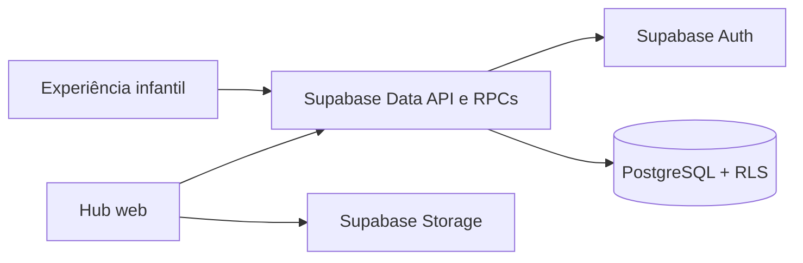
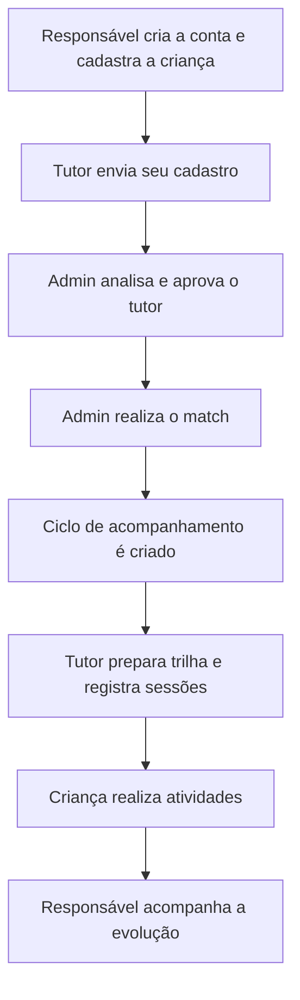
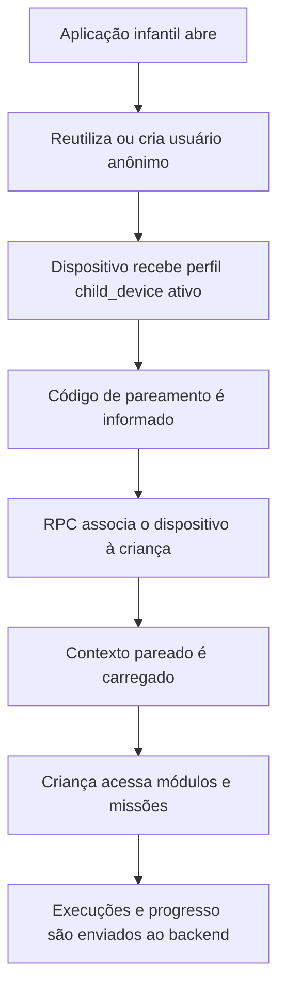

# Arquitetura — Cognita Hub

Última revisão: 3 de setembro de 2026.

## Visão geral

O Cognita Hub possui três partes principais:

1. Hub web para responsáveis, tutores e administração.
2. Experiência infantil para realizar missões e acompanhar a jornada.
3. Backend compartilhado no Supabase.



O frontend é uma aplicação multipágina. Cada arquivo HTML é uma entrada do Vite e carrega módulos JavaScript responsáveis pela interface e pelo acesso aos dados.

## Stack

Frontend:

- HTML5;
- CSS3;
- JavaScript com ES Modules;
- Vite.

Backend:

- Supabase Auth;
- PostgreSQL;
- Row Level Security (RLS);
- funções PostgreSQL expostas como RPC;
- Supabase Storage.

Proteção complementar:

- Cloudflare Turnstile para a criação de sessões anônimas no fluxo infantil.

## Estrutura principal

```text
cognita-hub/
├── apps/mobile/        # módulos da experiência infantil
├── css/                # estilos do hub e das páginas
├── js/
│   ├── components/     # componentes compartilhados
│   ├── data/           # consultas, comandos e RPCs do Supabase
│   ├── lib/            # autenticação, cliente Supabase e utilitários
│   └── pages/          # controladores das páginas
├── pages/              # entradas HTML do Vite
├── public/             # assets servidos sem transformação
├── docs/               # arquitetura, banco e roadmap
├── index.html          # página pública inicial
└── vite.config.js      # entradas do build multipágina
```

### Responsabilidades das camadas

- `pages/` define a estrutura de cada tela.
- `js/pages/` coordena estado, eventos e renderização de cada tela.
- `js/components/` concentra componentes reutilizáveis do hub.
- `js/data/` é a fronteira principal entre o hub e o Supabase.
- `js/lib/` reúne infraestrutura compartilhada, incluindo autenticação.
- `apps/mobile/src/` concentra serviços, telas, atividades e assets da experiência infantil modular.

## Identidades e papéis

| Papel | Responsabilidade | Autenticação |
|---|---|---|
| `guardian` | Responsável pela criança | E-mail e senha |
| `tutor` | Tutor voluntário validado pela equipe | E-mail e senha |
| `admin` | Equipe Cognita | E-mail e senha; papel atribuído de forma administrativa |
| `child_device` | Identidade técnica de um dispositivo infantil | Usuário anônimo do Supabase |

`auth.users` mantém a identidade de autenticação e `profiles` mantém o papel e o estado usados pela aplicação. Para usuários anônimos, o trigger de criação de perfil define `role = child_device` e `status = active`.

Um usuário anônimo do Supabase assume o papel PostgreSQL `authenticated`; por isso, a autorização infantil não pode depender apenas desse papel. Ela também verifica a identidade anônima, o perfil `child_device` e o vínculo ativo em `paired_devices`.

## Fluxo adulto



Responsáveis e tutores entram com e-mail e senha. As páginas protegidas recuperam o perfil no banco, verificam papel e estado e redirecionam acessos incompatíveis.

## Fluxo infantil



A sessão anônima é persistida no navegador para evitar a criação de um usuário novo a cada tentativa. O pareamento pode ser revogado pela família ou removido no próprio dispositivo sem apagar a criança.

## Autorização

O frontend nunca é a fonte de autoridade para permissões. Ele melhora a navegação, mas as decisões de acesso pertencem ao banco e combinam:

- `profiles.role` e `profiles.status`;
- relações entre responsáveis, tutores, crianças e ciclos;
- vínculo ativo em `paired_devices`;
- políticas RLS;
- funções PostgreSQL com validações próprias.

Metadados editáveis pelo usuário não devem ser usados diretamente como fonte de autorização. O cadastro público só pode originar `guardian` ou `tutor`; `admin` não é concedido pelo frontend.

## Banco e evolução do schema

O schema em produção é atualmente a fonte de verdade. Os antigos scripts executados manualmente foram removidos de `docs/` porque não formavam uma sequência reproduzível de migrations.

Enquanto não existir uma baseline versionada em `supabase/migrations/`, mudanças no banco devem ser conferidas diretamente no projeto Supabase e refletidas em [DATABASE.md](./DATABASE.md). A criação da baseline está registrada no [ROADMAP.md](./ROADMAP.md).
