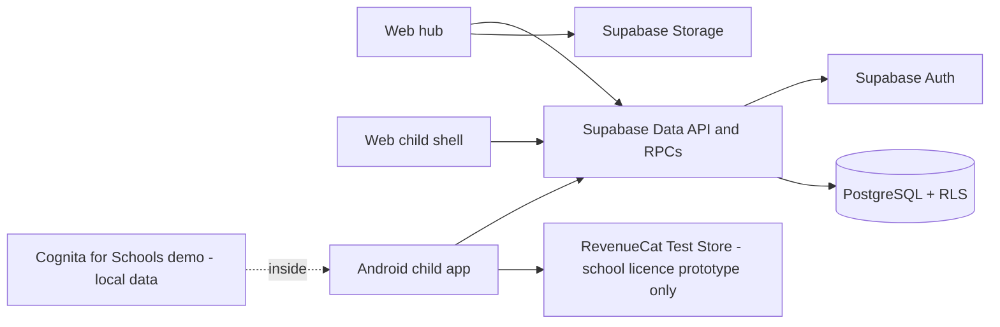
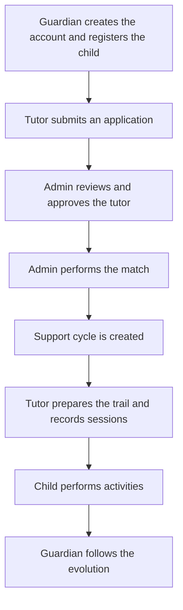
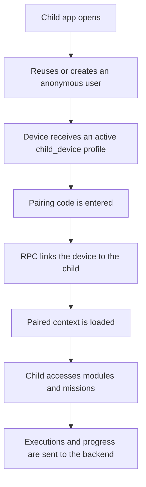

# Architecture — Cognita Hub

Last revised: October 1, 2026.

## Overview

Cognita Hub has four main parts:

1. A web hub for guardians, tutors and administration.
2. The child experience, which exists in two places: the Android app
   (`apps/mobile`) and a web child shell used by the hub for previews and tests.
3. The Cognita for Schools demo, inside the Android app, running on fabricated
   local data (no backend).
4. A shared backend on Supabase.


```mermaid
flowchart LR
    WEB[Web hub] --> API[Supabase Data API and RPCs]
    WEBCHILD[Web child shell] --> API
    ANDROID[Android child app] --> API
    ANDROID --> RC[RevenueCat Test Store - school licence prototype only]
    SCHOOLS[Cognita for Schools demo - local data] -. inside .-> ANDROID
    API --> AUTH[Supabase Auth]
    API --> DB[(PostgreSQL + RLS)]
    WEB --> STORAGE[Supabase Storage]
```

The web frontend is a multi-page application. Each HTML file is a Vite entry that
loads the JavaScript modules responsible for the interface and for data access.
The Android app is a separate single-page package with no framework router.

## Stack

Frontend (web):

- HTML5;
- CSS3;
- JavaScript with ES Modules;
- Vite.

Android app (`apps/mobile`):

- Vanilla JavaScript with ES Modules and Vite;
- Capacitor 8 (Android);
- the RevenueCat Purchases plugin (school licence prototype);
- Lucide icons.

Backend:

- Supabase Auth;
- PostgreSQL;
- Row Level Security (RLS);
- PostgreSQL functions exposed as RPC;
- Supabase Storage.

Complementary protection:

- Cloudflare Turnstile for creating anonymous sessions in the **web** child flow
  (`js/pages/app-crianca.js`, `js/lib/turnstile.js`). The Android app has no
  Turnstile code and signs in anonymously without a CAPTCHA token. If CAPTCHA
  protection is enabled for anonymous sign-ins in the Supabase project, this must
  be checked against the live configuration — it is not verified here.

## Main structure

```text
cognita-hub/
├── apps/mobile/        # Android app (Capacitor): child experience, device pairing, school licence prototype and the Cognita for Schools demo — the Shipaton artifact
│   └── src/
│       ├── activities/ # molds and dispatch by activity.molde (contar, identificar)
│       ├── components/ # small UI pieces
│       ├── config/     # local configuration (avatars, module visuals)
│       ├── demo/       # Cognita for Schools demo on local data: school overview, student hub, tutor, child, family
│       ├── screens/    # rendering and callbacks
│       ├── services/   # the mobile boundary to Supabase (and RevenueCat)
│       ├── styles/     # CSS imported by the modules
│       └── utils/
├── css/                # web hub styles
│   └── tutor/          # tutor panel: one file per area (the <link> order is the cascade order)
├── js/
│   ├── components/     # shared components
│   ├── data/           # Supabase queries, commands and RPCs
│   ├── lib/            # authentication, Supabase client and utilities
│   └── pages/          # page controllers
│       └── tutor/      # tutor panel: one module per behavior (index.js composes them)
├── pages/              # Vite HTML entries (web hub)
├── public/             # web hub assets, served at /assets/ without transformation
├── assets/             # README and submission media
├── docs/               # product, architecture, database, mobile and roadmap
├── index.html          # public landing page
└── vite.config.js      # entries of the multi-page web build
```

The web hub (`pages/`, `js/`, `css/`) and the app in `apps/mobile/` are
independent packages: the root `npm run build` compiles only the web hub, and a
Vite build of either package does not validate an Android APK.

### Responsibilities of the layers

- `pages/` defines the structure of each web screen.
- `js/pages/` coordinates state, events and rendering for each web screen. The
  tutor panel (`js/pages/tutor.js`) is only the entry point; the logic lives in
  `js/pages/tutor/`, with shared state in `tutor/state.js`.
- `js/components/` holds the reusable components of the hub.
- `js/data/` is the main boundary between the hub and Supabase.
- `js/lib/` gathers shared infrastructure, including authentication.
- `apps/mobile/src/app.js` orchestrates the connected child flow; there is no
  router, and `screen`/`openModule` exist so that the Android back button knows
  what to do.
- `apps/mobile/src/screens/`, `activities/` and `services/` hold the child
  screens, the molds and the mobile boundary to Supabase.
- `apps/mobile/src/demo/` is local only: it never calls Supabase.

### Two child implementations

Child-facing code exists in two places, and **both are active**:

- the Android app (`apps/mobile/src/`);
- the web child shell (`js/pages/app-crianca.js` and `js/pages/modo-crianca.js`),
  which the tutor panel opens for previews, tests and demo links.

They share no code. The molds `contar` and `identificar` are implemented twice
(`js/pages/moldes/` for the web, `apps/mobile/src/activities/` for Android), and
the mobile app does not import `js/data/moldes-registro.js`. Do not assume the two
are synchronized, and do not propagate a change from one to the other only for
consistency. Consolidation is tracked in the [ROADMAP](./ROADMAP.md).

`js/data/moldes-registro.js` is the single source of truth for what each mold is
on the web side. It is consumed by the tutor activity wizard, the tutor activity
and session screens, the journey builder, the plan component and the web child
shell, so check its consumers before changing it.

## Identities and roles

| Role | Responsibility | Authentication |
|---|---|---|
| `guardian` | Guardian of the child | Email and password |
| `tutor` | Volunteer tutor validated by the team | Email and password |
| `admin` | Cognita team | Email and password; role assigned administratively |
| `child_device` | Technical identity of a child's device | Anonymous Supabase user |

`auth.users` holds the authentication identity and `profiles` holds the role and
status used by the application. For anonymous users, the profile-creation trigger
sets `role = child_device` and `status = active`.

An anonymous Supabase user takes the PostgreSQL role `authenticated`; therefore
child authorization cannot depend on that role alone. It also checks the
anonymous identity, the `child_device` profile and the active link in
`paired_devices`.

## Adult flow


```mermaid
flowchart TD
    A[Guardian creates the account and registers the child] --> B[Tutor submits an application]
    B --> C[Admin reviews and approves the tutor]
    C --> D[Admin performs the match]
    D --> E[Support cycle is created]
    E --> F[Tutor prepares the trail and records sessions]
    F --> G[Child performs activities]
    G --> H[Guardian follows the evolution]
```

Guardians and tutors sign in with email and password. Protected pages fetch the
profile from the database, check role and status, and redirect incompatible
access.

## Child flow


```mermaid
flowchart TD
    A[Child app opens] --> B[Reuses or creates an anonymous user]
    B --> C[Device receives an active child_device profile]
    C --> D[Pairing code is entered]
    D --> E[RPC links the device to the child]
    E --> F[Paired context is loaded]
    F --> G[Child accesses modules and missions]
    G --> H[Executions and progress are sent to the backend]
```

The anonymous session is persisted on the device to avoid creating a new user on
every attempt (the Android app uses the storage key
`cognita-mobile-child-auth-v1`, separate from the web adult session). Pairing can
be revoked by the family or removed on the device itself without deleting the
child.

The planned immediate entry (trying an activity without a session or pairing) is
described in [MOBILE.md](./MOBILE.md); it is not implemented yet. Today the
Android app signs in anonymously and queries the pairing as soon as it opens.

## Authorization

The frontend is never the source of authority. It improves navigation, but access
decisions belong to the database and combine:

- `profiles.role` and `profiles.status`;
- relationships between guardians, tutors, children and cycles;
- the active link in `paired_devices`;
- RLS policies;
- PostgreSQL functions with their own validations.

User-editable metadata must not be used directly as a source of authorization.
Public signup can only produce `guardian` or `tutor`; `admin` is not granted by
the frontend.

## Database and schema evolution

The production schema is currently the source of truth. The old manually executed
scripts were removed from `docs/` because they did not form a reproducible
sequence of migrations.

Until a versioned baseline exists in `supabase/migrations/`, database changes must
be checked directly against the Supabase project and reflected in
[DATABASE.md](./DATABASE.md). Creating the baseline is recorded in the
[ROADMAP](./ROADMAP.md).
