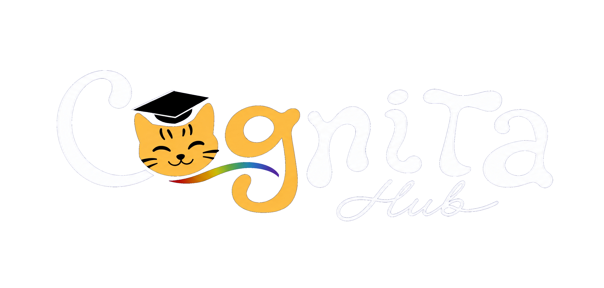
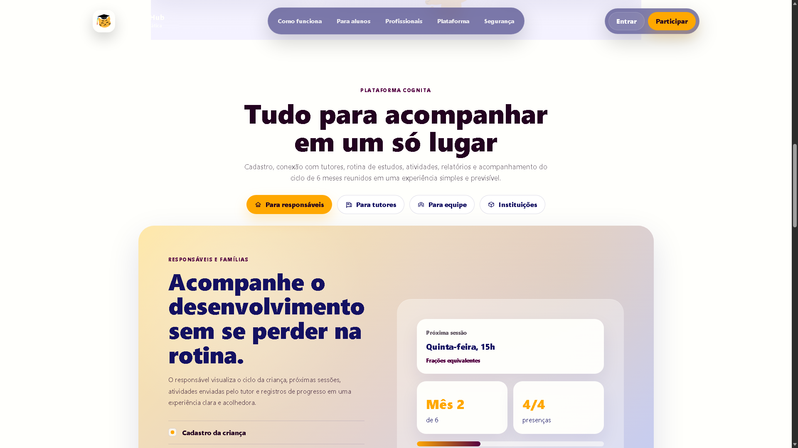
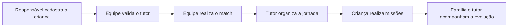

<p align="center">
  
</p>

<h1 align="center">Cognita Hub</h1>

<p align="center">
  <strong>A matemática ao alcance de cada mente.</strong>
</p>

<p align="center">
  Plataforma educacional inclusiva que conecta crianças com TEA, responsáveis e tutores voluntários para apoiar a aprendizagem matemática.
</p>

<p align="center">
  
  
  
</p>

## Sobre o projeto

O Cognita Hub apoia crianças com TEA de 5 a 9 anos que encontram barreiras na aprendizagem matemática. A plataforma organiza a colaboração entre a família, tutores voluntários e a equipe Cognita, com atividades adaptadas, trilhas de aprendizagem e acompanhamento do progresso.

O produto tem duas experiências integradas:

- um hub web para responsáveis, tutores e administração;
- uma experiência infantil com missões, atividades e jornada visual.

<p align="center">
  
</p>

## Como funciona


```mermaid
flowchart LR
    A[Responsável cadastra a criança] --> B[Equipe valida o tutor]
    B --> C[Equipe realiza o match]
    C --> D[Tutor organiza a jornada]
    D --> E[Criança realiza missões]
    E --> F[Família e tutor acompanham a evolução]
```

Atualmente o projeto inclui autenticação por papel, cadastro de crianças e tutores, triagem administrativa, match, ciclos de acompanhamento, sessões, atividades, trilhas, progresso e pareamento da experiência infantil.

## Tecnologias

- HTML5, CSS3 e JavaScript com ES Modules;
- Vite para desenvolvimento e build;
- Supabase Auth, PostgreSQL, Row Level Security e funções RPC;
- Cloudflare Turnstile no fluxo de autenticação anônima infantil.

## Executar localmente

Requisitos: Node.js e npm.

```bash
git clone https://github.com/markussdev/CognitaHub.git
cd CognitaHub
npm install
```

Crie um arquivo `.env` na raiz:

```env
VITE_SUPABASE_URL=https://SEU-PROJETO.supabase.co
VITE_SUPABASE_ANON_KEY=SUA_CHAVE_PUBLICAVEL
VITE_TURNSTILE_SITE_KEY=SUA_SITE_KEY
```

Use somente a chave publicável do Supabase no frontend. Nunca coloque a `service_role` no `.env` usado pelo Vite.

Inicie o servidor:

```bash
npm run dev
```

Para validar o build de produção:

```bash
npm run build
```

## Documentação

- [Arquitetura](./docs/ARCHITECTURE.md): componentes, estrutura, papéis e fluxos.
- [Banco de dados](./docs/DATABASE.md): schema real organizado por domínio.
- [Roadmap](./docs/ROADMAP.md): estado atual, prioridades e dívida técnica.

## Responsabilidade

O Cognita Hub é uma ferramenta de apoio educacional. Não substitui acompanhamento clínico, psicológico, terapêutico, médico nem diagnóstico profissional.

## Equipe

Projeto desenvolvido pela equipe **C-FORCE** para o **Desafio Liga Jovem — 4ª edição**.

Belém, Pará — 2026.
