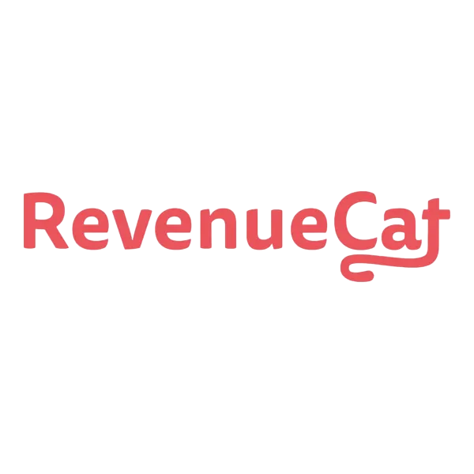

<p align="center">
  
</p>

<h1 align="center">Cognita Hub</h1>

<p align="center">
  <strong>Mathematics within reach of every mind.</strong>
</p>

<p align="center">
  A human-centered educational ecosystem that supports families, educators and mediators
  in adapting mathematics learning experiences for children with autism.
</p>

<p align="center">
  
  
  
</p>

---

## What is Cognita Hub?

Cognita Hub is a digital ecosystem designed to support the human mediation of
mathematics learning for children with autism, initially focused on ages 5–9.

The project is built around a simple principle:

> Technology should support the people who know the child — not pretend to replace them.

Instead of automatically deciding how a child should learn, Cognita helps adults
prepare experiences, adapt support, observe what happened and use that context
to improve the next learning experience.

## Why Cognita?

Children on the autism spectrum do not form a homogeneous group.

A visual stimulus, animation, instruction style or support strategy that helps
one child may not help another. Because of that, Cognita avoids treating a
diagnosis as an instruction manual.

The platform does not use logic such as:

```text
Autism profile X → Activity Y
```

Learning is also not reduced to a score such as:

```text
8 correct answers out of 10 = 80% progress
```

Cognita is interested in the context around the answer:

- What kind of support was needed?
- How did the child participate?
- What did the mediator observe?
- What happened during that specific experience?
- What could be tried next?

## Learning experience

<p align="center">
  
  &nbsp;&nbsp;
  
</p>

<p align="center">
  <sub>
    The Android experience presents learning journeys as explorable worlds,
    while keeping the interface simple and child-focused.
  </sub>
</p>

The current Android prototype includes child-device pairing, learning journeys,
interactive mathematics activities, profile personalization and configurable
experience settings.

The activity layer is modular, allowing Cognita to evolve beyond a single
interaction model while keeping the same learning journey structure.

## The learning cycle

Cognita is organized around a continuous human-mediated cycle:

<p align="center">
  <strong>KNOW → ADAPT → MEDIATE → OBSERVE → LEARN ↺</strong>
</p>

**Know** — understand the child and the current context.

**Adapt** — choose or adjust a learning experience.

**Mediate** — an adult supports the experience instead of leaving the software
to make every pedagogical decision.

**Observe** — record what happened, including support and participation.

**Learn** — use those observations to improve the next experience.

## The ecosystem

| Child | Mediator | Family |
| --- | --- | --- |
| Interactive mathematics experiences and learning journeys. | Prepares experiences, follows sessions and records observations. | Receives guided feedback and follows the learning journey. |

The three experiences share the same learning cycle, but they do not share the
same interface or responsibilities.

## Cognita Escola

Cognita's current monetization direction is institutional rather than
child-facing.

Instead of placing accessibility or learning support behind a family paywall,
Cognita Escola explores recurring licensing for schools and educational
institutions.

An institution can adopt the ecosystem to support:

- mediated mathematics experiences;
- student learning journeys;
- session and observation history;
- family feedback;
- educator workflows.

### RevenueCat integration

The Android prototype includes a working RevenueCat integration using the
RevenueCat Test Store.

<p align="center">
  
  &nbsp;&nbsp;&nbsp;&nbsp;
  
</p>

The purchase flow implemented for the Shipaton prototype is:

```text
Cognita Escola
      ↓
RevenueCat Offering
      ↓
Monthly Package
      ↓
Test Store Purchase
      ↓
CustomerInfo
      ↓
school_access entitlement
```

### Purchase flow validation

The RevenueCat integration was validated on a physical Android device using
the RevenueCat Test Store.

The following scenarios were tested successfully:

- valid purchase;
- failed purchase;
- cancelled purchase;
- `school_access` entitlement activation after a successful transaction.

This validation was performed in RevenueCat's development Test Store
environment and does not represent a production payment flow.

Current Test Store configuration:

```text
Offering:    cognita_school
Package:     $rc_monthly
Product:     cognita_school_pilot_monthly
Entitlement: school_access
```

The price displayed in the prototype is demonstrative and does not represent
validated commercial pricing.

## Product principles

Cognita is developed around a few non-negotiable principles:

- Person before diagnosis.
- Human pedagogical decisions remain human.
- Activities are proposals, not prescriptions.
- Accessibility is individual and configurable.
- Human observation is meaningful product data.
- Learning cannot be reduced to correct answers alone.
- Cognita does not diagnose children or replace educators and specialists.

The complete product direction is documented in
[`docs/PRODUCT.md`](./docs/PRODUCT.md).

## Technology

### Web

- Vanilla JavaScript
- CSS
- Vite
- Supabase

### Mobile

- Vanilla JavaScript
- Vite
- Capacitor 8
- Android
- Supabase
- RevenueCat Purchases SDK

### Backend

- Supabase PostgreSQL
- Authentication
- Row Level Security
- RPCs
- Storage

## Repository structure

```text
CognitaHub/
├── apps/
│   └── mobile/                # Android child experience (Capacitor)
│       ├── android/
│       └── src/
│           ├── activities/
│           ├── components/
│           ├── screens/
│           └── services/
├── assets/                    # shared visual assets
├── css/                       # web hub styles
├── docs/                      # architecture, database, product and roadmap docs
├── js/
│   ├── components/
│   ├── data/                  # Supabase boundary
│   ├── lib/                   # auth, Supabase client, shared utilities
│   └── pages/
├── pages/                     # Vite HTML entry points
├── public/
└── package.json
```

## Running locally

### Web

```bash
npm install
npm run dev
```

### Android

```bash
cd apps/mobile
npm install
```

Create `apps/mobile/.env` from `apps/mobile/.env.example` with:

```env
VITE_SUPABASE_URL=
VITE_SUPABASE_ANON_KEY=

VITE_REVENUECAT_TEST_API_KEY=
VITE_REVENUECAT_ENTITLEMENT_ID=school_access
VITE_REVENUECAT_OFFERING_ID=cognita_school
```

Then:

```bash
npm run build
npx cap sync android
```

On Windows:

```bash
cd android
.\gradlew.bat assembleDebug
```

The APK is generated at:

```text
apps/mobile/android/app/build/outputs/apk/debug/app-debug.apk
```

## Current status

Cognita Hub is an evolving prototype.

Already implemented:

- web experiences for mediators and families;
- child Android application;
- device pairing;
- learning journeys;
- interactive activity engine;
- configurable experience settings;
- session records and family feedback;
- RevenueCat Test Store integration;
- institutional licensing prototype.

Currently being improved:

- immediate activity exploration without pairing;
- broader activity formats;
- multimodal learning experiences;
- richer support and observation records.

## Team

Cognita Hub is developed by **C-FORCE**, a Brazilian student team combining
software development, education research and continuous validation with
educators and researchers.

## License

This project is distributed under the ISC License.

See [`LICENSE`](./LICENSE).
